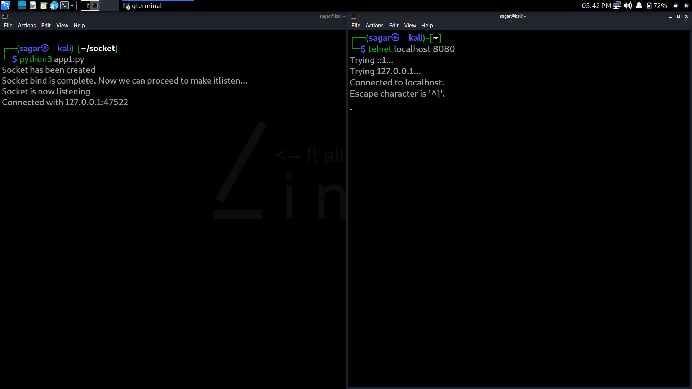

# Socket_kali-linux
A Kali Linux web server that listens to a certain port and connects to the client / connect to a remote web server like google.

------------------------------------------------

## What is socket? 
## -- On a computer network, there are internal endpoints that are meant for sending and receiving data within a node. A socket is the representation of these endpoints. Sockets are the fundamental things behind these network applications.

---- 
 ## How to run the programs?
- -
 ### Step1: Open terminal and run the python file.
 
 ``` 
 $ python3 app1.py
 ```
 <p align="center">
  
<p>

- -
### Step2: Open second terminal to write the following code.
```
$ telnet localhost 8080
```
<p align="center">
  
<p>

----
----

 ## Cloning this repositary using command line
 1. Open **Git Bash**.
 2. Change the current working directory to the location where you want the cloned directory.
 3. Type `git clone https://github.com/Sagar-Sharma-7/Socket_kali-linux.git`
 4. Press **Enter** to create the clone of this repositary.

 ## How to reach me?
 [ ](mailto:6969sagarsharma@gmail.com)

 <hr>
 <p float="left">

[](https://github.com/Sagar-Sharma-7)
[ ](https://github.com/Sagar-Sharma-7)

</p>


[](https://github.com/Sagar-Sharma-7)
